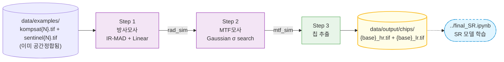

<div align="center">

# data_preprocessing

### KOMPSAT-3A → Sentinel-2 방사·MTF 모사 기반 SR 학습 데이터 전처리 파이프라인

**이미 공간정합된 KOMPSAT-3A/Sentinel-2 페어를 입력받아, 방사모사·MTF모사·칩 추출까지 자동 수행하여 초해상화(Super-Resolution) 학습용 HR/LR 칩 페어를 생성합니다.**

[](https://www.python.org/)
[](https://rasterio.readthedocs.io/)
[](#)

</div>

---

## 📖 개요

이 프로젝트는 KARI의 **KOMPSAT-3A (2.5m 해상도)** 위성영상을 ESA **Sentinel-2 (10m 해상도)** 의 방사·광학 특성으로 변환하여, `PrithviSR/final_SR.ipynb` 학습 노트북이 바로 사용할 수 있는 **HR/LR 칩 페어**를 만드는 데이터 전처리 파이프라인입니다.

### 이전 버전과의 차이
원래는 이 프로젝트 안에서 Copernicus/KARI 원본 다운로드부터 RPC 정사보정·공통격자 생성까지 직접 수행했지만 (구 module1_data_download, module2_coregistration), 현재는 **이미 공간정합이 끝난 KOMPSAT-3A/Sentinel-2 페어**를 `data/examples/`에 공급받는 것을 전제로 합니다. 즉 파이프라인의 시작점이 "원본 다운로드"가 아니라 **"정합된 페어 → 방사·MTF 모사 → 칩 추출"** 로 단순화되었습니다.

### 왜 방사·MTF 모사가 필요한가
- **실측 LR/HR 페어의 부재**: KOMPSAT-3A와 Sentinel-2는 다른 센서·궤도·시기 — 단순히 KOMPSAT-3A를 다운샘플링한 가짜 LR은 실제 Sentinel-2의 PSF·방사 특성을 반영하지 못함.
- **대안: 통계적 모사**: KOMPSAT-3A에 (a) 방사 정규화 + (b) 추정된 PSF를 적용 → 4× 다운샘플 시 Sentinel-2와 통계적·공간적으로 동등한 영상 생성.

---

## 🔭 파이프라인 흐름



| 단계 | 입력 | 출력 | 핵심 알고리즘 |
|---|---|---|---|
| **Step 1** | `kompsat{N}.tif` + `sentinel{N}.tif` | 방사모사 KOMPSAT-3A | IR-MAD (Iteratively Reweighted MAD) + 선형회귀 |
| **Step 2** | rad_sim 결과 | MTF모사 KOMPSAT-3A | Gaussian σ MSE 최소화 + Phase Correlation fallback |
| **Step 3** | mtf_sim + `kompsat{N}.tif` | HR/LR 칩 페어 | 1/3 중첩 슬라이딩, valid-ratio 필터 |

---

## 🚀 빠른 시작

### 환경 구축
simulation 모듈은 `rasterio` 만으로 동작합니다 (RPC 정사보정용 완전한 GDAL 스택이 더 이상 필수가 아님). **Python 3.10 이상 필수** — 코드가 `float | None` 같은 PEP 604 타입 힌트 문법을 사용합니다.

```bash
pip install rasterio numpy scipy scikit-image
```

### 데이터 배치
```
data/examples/
  ├── kompsat1.tif   # HR, 2.5m, 4밴드(B/G/R/NIR), 896×896
  ├── sentinel1.tif  # 실측 Sentinel-2, 10m, 4밴드, 224×224 — 방사보정 기준
  ├── sim1.tif       # (선택) 검증용 참고 정답 — 이미 모사된 KOMPSAT-3A
  ├── kompsat2.tif / sentinel2.tif / sim2.tif
  └── kompsat3.tif / sentinel3.tif / sim3.tif
```
`kompsat{N}.tif`와 `sentinel{N}.tif`는 **같은 origin·CRS를 공유하고 픽셀 비율이 정확히 4:1** 이어야 합니다 (이미 공간정합된 상태로 공급).

### 실행 (전체 파이프라인)
```bash
# 1. 방사 모사 (IR-MAD + 선형회귀)
python simulation/scripts/run_simulation.py

# 2. MTF 모사 (가우시안 PSF σ 탐색)
python simulation/scripts/run_mtf_simulation.py

# 3. 학습용 칩 추출 (HR 896×896 / LR 224×224)
python simulation/scripts/run_chip_extraction.py
```
각 단계는 **개별 페어 단위로 idempotent** — 중간에 중단되어도 재실행 시 완료된 페어는 자동 스킵.

---

## 🗂 프로젝트 구조

```
data_preprocessing/
├── claude.md                          # 코딩 가이드라인 + 알려진 이슈
├── config/
│   ├── paths.json                     # 모든 경로 단일 소스
│   ├── processing_params.json         # 알고리즘 하이퍼파라미터
│   └── sensor_specs.json              # KOMPSAT-3A/Sentinel-2 센서 사양
│
├── simulation/                        # 방사·MTF 모사 + 칩 추출 (핵심 모듈, 구 module3_simulation)
│   ├── src/
│   │   ├── ir_mad.py                  # IR-MAD CCA 반복
│   │   ├── linear_norm.py             # PIF 기반 선형회귀
│   │   ├── pipeline.py                # 방사모사 통합
│   │   └── mtf.py                     # PSF σ 추정 + Phase Correlation fallback
│   └── scripts/
│       ├── run_simulation.py          # 방사모사 배치 (data/examples/ 직접 스캔)
│       ├── run_mtf_simulation.py      # MTF 모사 배치
│       └── run_chip_extraction.py     # 칩 추출 배치
│
├── shared/utils/                      # simulation 모듈 공통 유틸리티
│   ├── paths.py                       # paths.json 로딩
│   └── proj_env.py                    # GDAL/PROJ 환경 초기화 (osgeo 없어도 동작)
│
└── data/
    ├── examples/    kompsat{N}.tif, sentinel{N}.tif, sim{N}.tif  # 입력 (이미 정합됨)
    └── output/      {rad_sim, mtf_sim, chips}                   # 파이프라인 산출물
```

> module1_data_download(원본 다운로드), module2_coregistration(RPC 정사보정·공통격자 생성), module4_visualization, module5_SR_comparison 은 모두 삭제되었습니다 — 이제 정합된 페어를 외부에서 공급받아 방사·MTF 모사만 수행합니다.

---

## 🧠 핵심 설계 결정

### 1️⃣ 입력은 이미 공통 가상격자 위에 있다고 가정
`kompsat{N}.tif`(2.5m)와 `sentinel{N}.tif`(10m)는 같은 origin에서 생성되어 **정확히 4:1 픽셀 비율**을 갖는다고 전제합니다. 1~2픽셀 오차는 파이프라인이 공통 부분만 잘라 자동 보정하지만, 그 이상 어긋난 데이터는 지원하지 않습니다.

### 2️⃣ IR-MAD 기반 PIF 자동 탐지
계절·대기·조명 차이가 있는 두 영상에서 **불변 픽셀(Pseudo-Invariant Features)** 만 추출해 회귀 학습. χ² CDF 보수로 픽셀별 불변 확률 산출, `≥0.95` 만 PIF로 채택.

### 3️⃣ 다단계 σ 최적화 + Phase Correlation Fallback
MTF 모사의 핵심: KOMPSAT-3A에 가우시안 블러 → 4× 다운샘플 → Sentinel-2와 robust MSE 최소화. σ가 탐색 경계에 갇히면 percentile cutoff를 단계적으로 완화하고, 그래도 실패하면 `phase_cross_correlation`으로 sub-pixel shift를 측정해 재최적화합니다.

### 4️⃣ NoData 블리딩 차단 (`normalized_gaussian_filter`)
일반 가우시안 블러는 NoData=0 픽셀을 valid 0으로 취급해 가장자리를 어둡게 만듭니다. `gaussian_filter(V*mask) / gaussian_filter(mask)` 패턴으로 수학적으로 차단합니다.

---

## 📊 데이터 명세

### 입력 (`data/examples/`)
| 파일 | 해상도 | 크기 | 밴드 | 역할 |
|---|---|---|---|---|
| `kompsat{N}.tif` | 2.5m | 896×896 | 4 (B/G/R/NIR) | HR 정답, 방사모사 대상 |
| `sentinel{N}.tif` | 10m | 224×224 | 4 (B/G/R/NIR) | 방사보정 기준(실측) |
| `sim{N}.tif` (선택) | 10m | 224×224 | 4 (B/G/R/NIR) | 검증용 참고 정답 |

### 출력 칩 페어 (`data/output/chips/{label}_{scene}/`)
| 칩 | 크기 | 해상도 | Footprint | 파일명 |
|---|---|---|---|---|
| **HR** | 896×896 | 2.5m | 2240×2240m | `{base}_hr.tif` |
| **LR** | 224×224 | 10m | 2240×2240m (동일) | `{base}_lr.tif` |

비율 4:1, 동일 footprint, 동일 CRS. 칩마다 `{base}_meta.json` 사이드카(bbox, transform, valid_ratio 등) 동봉.

---

## 🔧 설정

### `config/paths.json`
```json
{
  "examples_dir": "data/examples",
  "output_dir": "data/output",
  "rad_sim_dir": "data/output/rad_sim",
  "mtf_sim_dir": "data/output/mtf_sim",
  "chips_dir": "data/output/chips"
}
```

### 핵심 CLI 옵션
| 스크립트 | 옵션 | 기본값 |
|---|---|---|
| `run_simulation.py` | `--examples-dir`, `--pif-threshold`, `--max-iter` | `data/examples`, 0.95, 50 |
| `run_mtf_simulation.py` | `--sigma-min`, `--sigma-max` | 0.05, 9.0 |
| `run_chip_extraction.py` | `--examples-dir`, `--lr-size`, `--stride-lr`, `--valid-threshold` | `data/examples`, 224, 150, 0.8 |

---

## 📦 주요 결과 (3페어 검증, 2026-09-19)

`data/examples/`의 예시 3페어(같은 KOMPSAT-3A 씬에서 추출한 칩 0000/0001/0002)로 Step 1→2→3 전체 파이프라인을 실행하고, 제공된 참고 정답(`sim{N}.tif`)과 대조 검증했습니다.

**배치 실행 결과**
```
방사모사(Step 1): 성공 3 / 스킵 0 / 실패 0
MTF모사(Step 2):  성공 3 / 스킵 0 / 실패 0
칩추출(Step 3):   페어 3, 칩 저장 3 / 스킵 0 / 실패 0
```

**참고 정답(sim{N}.tif) 대비 상관관계**
| Pair | PIF 개수 | Blue | Green | Red | NIR |
|---|---|---|---|---|---|
| 1 (kompsat1) | 160 (0.3%) | -0.97 ⚠️ | -0.98 ⚠️ | -0.87 ⚠️ | 0.90 |
| 2 (kompsat2) | 6 (0.0%) | 0.95 | 0.90 | 0.94 | 0.87 |
| 3 (kompsat3) | 33 (0.1%) | 0.98 | 0.98 | 0.93 | 0.90 |

- **Pair 2, 3은 전 밴드 강한 양의 상관관계(0.87~0.98), 오차(MAE) 5~22%** 수준으로 알고리즘이 정상 재현됨을 확인.
- **Pair 1만 Blue/Green/Red가 음의 상관관계**로 어긋남 — PIF가 유난히 적고(0.3%) 지표가 동질적인 칩이라 IR-MAD 선형회귀가 통계적으로 불안정해진 것으로 추정. **버그가 아니라 소규모 칩(2.24km²) 단위 테스트의 알려진 한계**이며, 실제 전체 씬(수십 km²) 단위로 돌리면 지표 다양성이 늘어나 완화될 것으로 예상됨. 전체 씬 데이터로 재검증이 필요.

---

## 🔗 학습 파이프라인 연동

`data/output/chips/`가 바로 상위 `PrithviSR/final_SR.ipynb`의 학습 데이터 소스입니다.
```python
dataset_root = os.path.join(PROJECT_ROOT, 'data_preprocessing', 'data', 'output', 'chips')
```
`{base}_lr.tif`(입력) + `{base}_hr.tif`(정답) 페어를 폴더별로 자동 스캔합니다. 학습 전 이 리포지토리의 3단계 스크립트를 먼저 실행해 칩을 생성해야 합니다.

---

## ⚠️ 알려진 이슈 / 환경 노트

1. **Python 3.10+ 필수** — `float | None` 등 PEP 604 문법 사용. Python 3.9에서는 import 단계에서 `TypeError` 발생.
2. **`osgeo`(GDAL Python 바인딩) 불필요** — RPC 정사보정 모듈이 삭제되어, `shared/utils/proj_env.py`가 필요로 하는 건 `gdal.UseExceptions()` 호출뿐이라 `rasterio`만으로 충분합니다. (`osgeo` 자체를 pip로 설치하려면 Windows에서 MSVC 빌드 도구가 필요해 번거로움 — 없어도 됨)
3. **시스템 PROJ 충돌 경고** — PostgreSQL/PostGIS 등이 설치돼 있으면 GDAL이 그쪽 `proj.db`를 잘못 집어 `DATABASE.LAYOUT.VERSION.MINOR` 경고가 뜰 수 있음. `shared/utils/proj_env.py`의 `PROJ_DATA`로 rasterio 번들 PROJ를 강제하면 대부분 완화됨(완전히 제거하려면 `run_chip_extraction.py`도 나머지 두 스크립트처럼 `rasterio.env.Env(PROJ_LIB=PROJ_DATA)`로 감싸는 개선 여지 있음).
4. **소규모 칩에서 IR-MAD 불안정** — 위 "주요 결과" 참고. PIF가 너무 적으면 회귀 부호가 뒤집힐 수 있음.

---

## 🛣 로드맵

- [ ] 전체 씬(수십 km²) 단위 데이터로 재검증 — 소규모 칩의 IR-MAD 불안정성이 완화되는지 확인
- [ ] `run_chip_extraction.py`에도 `PROJ_LIB` env 래핑 적용해 PROJ 경고 제거
- [ ] `final_SR.ipynb`의 "평가" 섹션(현재 옛 네이밍 사용 중)도 `_hr.tif`/`_lr.tif` 기준으로 통합
- [ ] 더 많은 페어 확보 후 실제 SR 모델 학습·벤치마크

---

## 🙏 출처 및 감사

- **KOMPSAT-3A 데이터**: [한국항공우주연구원 (KARI)](https://www.kari.re.kr/) / [아리랑3A호 위성영상](https://www.kompsat.kari.re.kr/)
- **Sentinel-2 데이터**: [ESA Copernicus](https://dataspace.copernicus.eu/)
- **IR-MAD 알고리즘**: Nielsen, A.A. (2007) *The Regularized Iteratively Reweighted MAD Method for Change Detection*. IEEE Trans. Image Processing 16(2).

---

## 📁 라이선스 / 인용

본 코드는 연구 목적으로 공개됩니다. 외부 데이터(KOMPSAT-3A, Sentinel-2)의 라이선스는 각 제공기관의 정책을 따르며, **KOMPSAT-3A 원본·가공본의 재배포는 제공처 협약 조건을 반드시 확인**해야 합니다.

---

<div align="center">

🛠 [코딩 가이드라인](claude.md)

</div>
